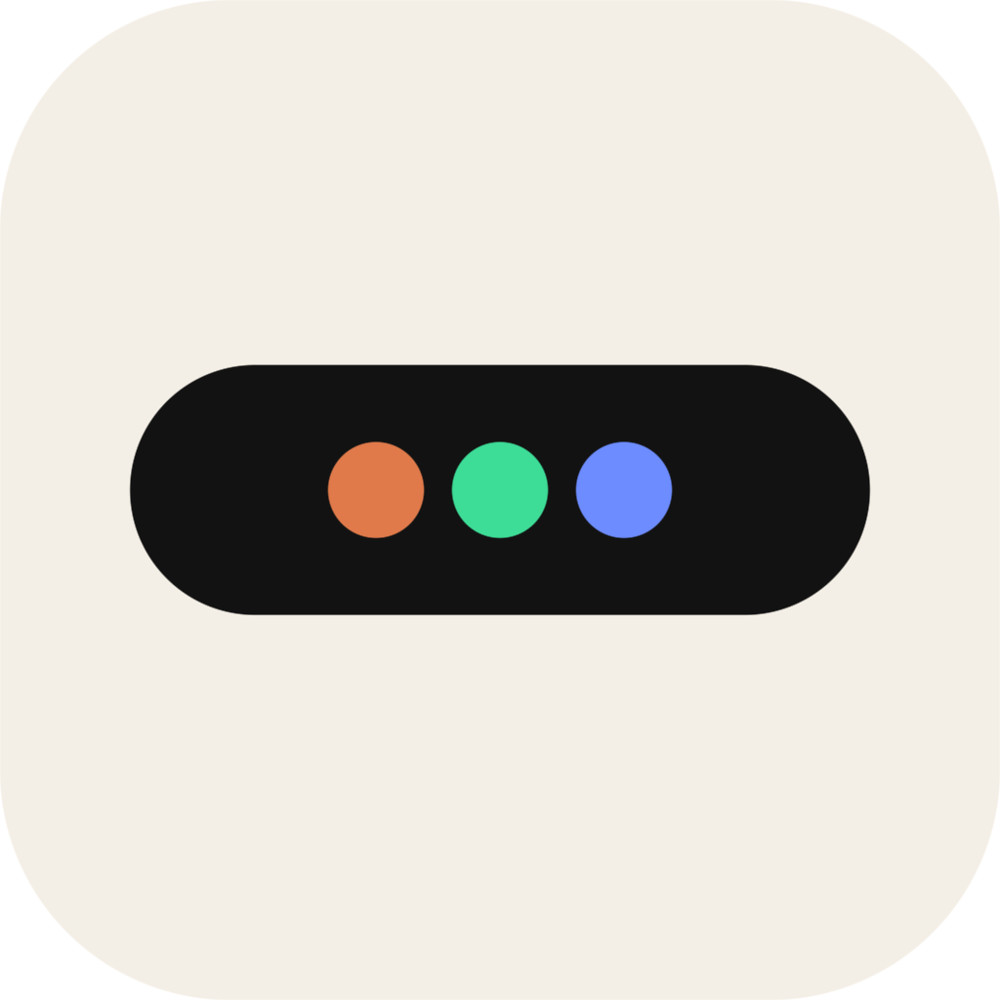

# Cute Island

<p align="center">
  
</p>

Windows、macOS、Linux 上的 PC 灵动岛。黑胶囊贴在屏幕顶部正中，用来看 agent 正在做什么。
首次启动默认位于顶部居中，可以按住胶囊或会话标题拖动；松手记住位置，重启后恢复。默认半透明，鼠标悬浮、拖动、键盘聚焦或点击展开时恢复实色，收起并移开焦点后恢复半透明。

闲置时它收成一条细胶囊。有活动时变成紧凑态：左侧是状态图标，右侧是一行标题。点一下展开，能看到 agent 名称、说明、进度、最近步骤和耗时。成功会短暂打勾后收回；失败保持展开，直到被新状态盖掉，或点「关闭」。

执行状态和操作类型使用 SVG 图标：命令终端、文件读写、搜索、MCP、Skill 和子 Agent 协作各有标识。执行中显示轻量动画，遵循系统「减少动态效果」设置。Codex 标识采用官方 VS Code 扩展使用的 OpenAI Blossom 矢量图形。

紧凑态、多会话列表和展开详情均显示来源客户端，独立于 Agent 名称和命令 Shell。例如同为 Claude Code 的会话可以分别标注 VS Code、Cursor、Windows Terminal 或 PowerShell。来源标签只用于展示；点击会话仍展开详情。

展开命令可查看命令内容、Shell 和工作目录；长命令支持换行、滚动和选择复制。MCP 显示服务与工具名称，Skill 显示读取或调用的技能名称，子 Agent 显示任务名称。需要审批时自动展开琥珀色提示，提醒到原 Agent 中审批；灵动岛只展示状态，不提供批准或拒绝操作。

## 开发

需要 Node.js 22.12 或更高版本。

```bash
npm install
npm run dev
```

只看界面、不启动 Electron 时：

```bash
npm run dev:web
```

浏览器打开 http://127.0.0.1:5174 。页面底部可以播放演示、模拟失败或清空。
还可以点击「MCP / Skill / 命令」查看各种操作，或点击「需要审批」查看审批提示。

## 把状态推过来

应用只监听 `127.0.0.1:17321`。端口用 `CUTE_ISLAND_PORT` 改。如果设置了 `CUTE_ISLAND_TOKEN`，请求要带 `Authorization: Bearer <token>` 或 `X-Island-Token`。

```bash
npm run island -- push --agent Cursor --state running --title "正在修改登录页" --progress 0.4
npm run island -- push --id vscode-task --agent Codex --client "VS Code" --state running --title "正在检查测试"
npm run island -- end --result success --summary "登录页已更新"
npm run island -- demo
```

也可以直接 POST：

```bash
curl -X POST http://127.0.0.1:17321/v1/activities \
  -H 'content-type: application/json' \
  -d '{"id":"run-1","agent":"Cursor","state":"running","title":"正在修改登录页","progress":0.4}'

curl -X POST http://127.0.0.1:17321/v1/activities/run-1/end \
  -H 'content-type: application/json' \
  -d '{"result":"success","summary":"登录页已更新"}'
```

`state` 可以是 `thinking`、`running`、`waiting`、`approval`、`success`、`error`。同一个 `id` 再次 POST 会合并更新。`GET /v1/activities` 返回当前活动。`WS /v1/events` 会在每次变化时推送 `{ "type": "activities", "activities": [...] }`。

多个活动同时存在时，按 agent 分组显示会话列表，点击各行查看详情。同一 agent 内按失败、需要审批、执行、思考、等待、成功排序。

HTTP 可传 `client: "VS Code"`，CLI 使用 `--client "VS Code"` 显式指定来源。省略时保留已有值；传 `client: null` 或 `--client null` 清空；名称最多 40 个字符。

可通过 CLI 显式推送操作和审批状态：

```bash
npm run island -- push --id task-1 --agent Codex --state approval --title "安装依赖" --command "npm install" --shell PowerShell --cwd "D:/projects/app" --detail "需要访问网络"
npm run island -- push --id task-1 --state running --kind mcp --name "context7 / query_docs" --title "获取组件文档"
npm run island -- push --id task-1 --state running --kind skill --name frontend-design --title "读取设计技能"
npm run island -- push --id task-1 --state thinking --kind null --title "整理结果"
```

HTTP 对应字段为 `operation: { kind, name?, command?, shell?, cwd? }`，`kind` 支持 `command`、`read`、`edit`、`search`、`mcp`、`skill`、`agent`、`tool`。传 `operation: null` 清空；普通更新省略时保留。步骤可带 `kind`，`status: "waiting"` 表示该步骤等待审批。

## 自动识别本机会话

应用启动时会恢复已经开始的本机会话，之后持续跟踪四种 agent 的日志。明确的回合结束标记会显示完成；工具失败或回合失败保持可见，直到关闭或有新状态。

检测到 agent 进程时，会从最近 24 小时、每种 agent 最新 64 个候选记录中寻找未结束的会话；已跟踪的会话不会因超过这个窗口而消失。新版 Claude Code 的忙碌会话还会通过 `~/.claude/sessions/<PID>.json` 和存活 PID 关联，可恢复超过 24 小时的长任务。没有进程依据时只检查最近两分钟的记录，且不复活旧的完成记录。文件暂时不更新不会被当作成功；已跟踪任务在进程消失且日志静默超过一分钟后显示中断。

| Agent | 记录位置 |
| --- | --- |
| Claude Code | `~/.claude/projects/<项目>/<会话>.jsonl` |
| Codex | `~/.codex/sessions/年/月/日/rollout-*.jsonl` |
| Gemini | `~/.gemini/tmp/<项目>/chats/session-*.json`，兼容 JSONL |
| Cursor | `~/.cursor/projects/<项目>/agent-transcripts/<会话>/<会话>.jsonl` |

Windows 上这些目录在 `%USERPROFILE%` 下面，布局相同。可以用 `CLAUDE_CONFIG_DIR`、`CODEX_HOME`、`GEMINI_CLI_HOME`、`CURSOR_HOME` 改根目录。支持原生可执行文件及通过 Node.js 启动的 npm agent。设置 `CUTE_ISLAND_WATCH=0` 可以关掉自动识别，只保留上面的 HTTP 接口。

扫描使用异步 I/O：已发现的日志约每 800 毫秒检查一次，新文件约每 10 秒发现一次，进程查询间隔 5 秒；内容未变化时不重新读取和解析。内置 Agent 的 JSONL 首次按 64 KiB 分块读取并建立状态，之后只解析追加的数据；保留未写完的记录，文件替换或截断后重新建立状态。后台任务的启动记录不会因落到文件尾部窗口以外而丢失；Gemini JSON 整份读取，上限 16 MiB。

子 Agent 与后台命令在展开后单独列出，紧凑态显示运行数量。嵌套子 Agent 会逐层合并到顶层会话；仍有下级任务运行时保持执行状态。默认清理静默超过 30 分钟且缺少存活依据的后台任务，但原生忙碌登记或仍活跃的下级任务会保留对应任务。会话元数据尚未写完整时暂缓归类，后续扫描会重试。

自动识别依赖各 agent 实际写出的日志。除可关联的 Claude 会话外，进程检测只能证明某种 agent 在运行，无法精确区分该进程下所有会话；缺少结束标记的旧日志仍可能被判断为活动。需要精确状态时可以使用 HTTP/CLI 推送。

客户端识别同样按会话取证：Codex 使用 `session_meta` 中的来源，命令行显示「CLI」，兼容编辑器共享的扩展标识显示「IDE 扩展」。新版 Claude Code 使用原生会话登记的 PID 和进程祖先识别宿主，优先显示编辑器或终端应用，其次显示 PowerShell、cmd 等 Shell；进程退出后保留本次运行中观察到的来源。没有可靠信息时显示「未知客户端」，不会根据工具的 Shell、工作目录或同类 Agent 进程猜测。Cursor/Gemini 等没有可关联来源的记录可通过 HTTP/CLI 指定客户端。

操作识别基于工具名称和记录的参数。读取 `SKILL.md` 表示「读取技能」，不代表能证明该技能后续的所有指令都已执行。MCP 支持直接工具调用和 `functions.exec` 中明确写出的静态 MCP 工具名；动态生成的调用名称无法可靠识别。审批识别支持明确的 Codex 审批请求、`sandbox_permissions: "require_escalated"` 请求和 Gemini 的等待审批状态；请求可能被原工具自动放行，后续执行或结果记录会更新状态。没有审批日志的会话不会根据等待时长或自然语言猜测为需要审批，可使用 `approval` 状态显式推送。

## 窗口

窗口无边框、透明、置顶，不进任务栏，也不抢焦点。只有胶囊本身接收点击，周围的透明区域会把鼠标让给下面的窗口。托盘菜单可以显示、隐藏、播放演示或退出。

拖动超过 5 像素才移动窗口，轻点仍展开详情；命令内容保留选择复制和滚动，关闭按钮可正常点击。胶囊可拖到屏幕边缘，展开时会自动避让边界，收起后回到拖动时的位置。显示器断开后会将胶囊移回可见区域；托盘「恢复顶部居中」可重置位置。位置记录保存在应用用户数据目录的 `window-position.json`，浏览器预览使用本地存储。

macOS 使用 panel，并在全屏空间保持可见。Windows 和 Linux 使用 screen-saver 级别置顶。Linux 需要桌面合成器，透明窗口才能透出后面的内容。

## 打包

```bash
npm run dist
```

该命令依次执行类型检查、测试、构建和当前平台打包，产物在 `release/`。仅生成可运行目录时用 `npm run pack`。配置已经写好 Windows NSIS、macOS dmg、Linux AppImage 和 deb。三端安装包都用 `build/icon.png`。

生产构建压缩 JS/CSS，React 和动画库只保留构建后的代码，不重复分发其 npm 包。Electron 仅打包简体中文、繁体中文和英语资源，并启用最大压缩；需要其他系统对话框语言时可扩展 `build.electronLanguages`。运行时仍使用 Electron，安装体积的主要部分来自 Chromium/Node.js。

Windows 打包后的集成验证（使用隔离的临时用户目录和端口，不安装应用）：

```bash
node scripts/smoke-packaged.cjs "release/win-unpacked/Cute Island.exe"
```

它验证启动前会话恢复、HTTP、preload、展开/关闭、成功自动收起和空闲布局开销，并将截图存入 `release/`。

拖动与透明度集成检查（使用隔离的 Electron 用户目录和模拟光标，不移动你的鼠标）：

```bash
npm run build
node scripts/smoke-interaction.cjs
```

它验证实际窗口移动、点击与拖动区分、命令选择、悬浮与展开的透明度、屏幕边缘避让、重启恢复和托盘重置，截图保存在 `output/playwright/`。

推送版本标签，或在 Actions 里手动运行 Release，都会在三端打包成功后发布到这个仓库的 [Releases](https://github.com/xihadance/cute-island/releases)。手动运行时，标签取 `package.json` 里的版本号，例如当前是 `v0.1.4`。

```bash
git tag v0.1.4
git push origin v0.1.4
```

## 图标

应用图标是米色圆角方块，中间一条黑胶囊，胶囊里三颗圆点：橙、绿、蓝。

| 文件 | 用途 |
| --- | --- |
| `build/icon.png` | 1024 像素，Windows、macOS、Linux 安装包图标 |
| `build/tray.png` | 32 像素托盘图标源图。运行时托盘读 `src/main/tray-icon.ts` 里嵌进去的同一张图 |
| `src/renderer/favicon.png` | 开发时浏览器页签图标，由 `src/renderer/index.html` 引用 |
